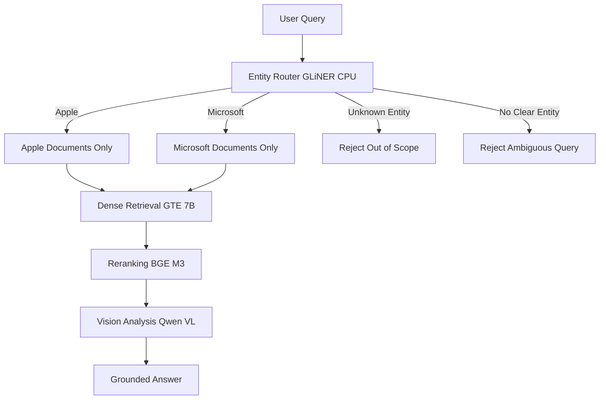

# Constrained Financial RAG (Vision-Native)

**Portfolio project – Master 1 Artificial Intelligence**

This project explores how **architectural constraints** can *reduce* common failure modes in Financial RAG systems, such as **cross-company document leakage** and **loss of table structure**.  
The system is **not perfect** and does **not guarantee correctness in all cases**. Its goal is to make errors **explicit, inspectable, and easier to reason about**.

---

## Quick Read (30 seconds)

- **What it is:** a small, controlled Financial RAG demo
- **Dataset:** 6 pages (Apple & Microsoft, 2023 annual reports)
- **Focus:** routing, scope control, inspectability
- **Approach:** constraints first, generation second
- **Reality:** imperfect by design, with documented limitations
- **Not:** production-ready, scalable, or exhaustive

If this sounds relevant, the sections below explain the design choices and trade-offs.

---

## Project Scope

This demo operates on a **controlled “Golden Dataset”** consisting of **6 pages** extracted from the **2023 annual reports of Apple and Microsoft**.

The project is **intentionally over-engineered relative to dataset size** to:
- highlight architectural decisions,
- surface failure modes,
- and document trade-offs clearly.

It is **not optimized for scale, cost, or production deployment**.

---

## TL;DR

- **Entity-based routing** significantly reduces cross-company document leakage
- **Scope enforcement** limits unsupported or ambiguous queries
- **Vision-native table analysis** reduces OCR-induced structural errors
- **Explicit failure paths** favor controlled rejection over hallucination
- Emphasis on **inspectability, provenance, and debuggability**

---

## Motivation

Many errors observed in Financial RAG systems are **structural rather than model-related**:

1. **Cross-document confusion**  
   Semantically similar passages from different companies may be retrieved together.

2. **Loss of table structure**  
   OCR-based pipelines often flatten tables, breaking row/column alignment.

This project investigates how **constraining the retrieval and reasoning space** can reduce recurring classes of these errors.

---

## Design Principle

> **Constraints first, generation second.**

Instead of relying on prompting to encourage correct behavior, the system:
- restricts what can be retrieved,
- restricts what can be answered,
- and fails explicitly when conditions are not met.

Constraints do not eliminate all errors, but they **reduce the space in which errors can occur** and make failures easier to inspect.

---

## Architecture Overview




## Key Components

### 1. Entity Routing (CPU – GLiNER)

- Named Entity Recognition is applied **before GPU usage**
- Queries are routed to a **single company namespace**
- Documents from different companies are **never intentionally mixed**

This significantly reduces cross-company leakage, although complex queries may still expose edge cases.

---

### 2. Retrieval & Reranking

- Dense retrieval: `gte-Qwen2-7B-instruct`
- Cross-encoder reranking: `bge-reranker-v2-m3`

Embeddings are recomputed **on-the-fly** to keep the pipeline:
- stateless
- inspectable

This increases latency but improves transparency.

---

### 3. Vision-Native Reasoning

- Financial pages are processed **as images**
- Tables are **not flattened via OCR**
- Numeric values are extracted from **visible content**

This reduces structural errors but does not eliminate all extraction mistakes.

---

## Example Queries & Observed Behavior

### Example 1

**Query:**  
> What was Apple’s net income in 2023?

**Observed behavior:**
- Routed to Apple documents only
- Relevant table page retrieved
- Numeric values extracted from the image

**Result:**  
Grounded answer with an explicit source reference.

---

### Example 2

**Query:**  
> Compare Apple and Google revenues

**Observed behavior:**
- Google is not in the allowlist
- Query is rejected with a clear explanation

**Rationale:**  
Controlled rejection is preferred over speculative generation.

---

### Example 3 (Edge Case)

**Query:**  
> What was Microsoft’s operating income growth compared to Apple?

**Observed behavior:**
- Entity routing succeeds
- Retrieval may favor one company depending on phrasing
- Output can be partially correct or incomplete

This highlights a limitation of NER-based routing when comparative intent is involved.

---

## Known Limitations & Trade-offs

Despite architectural constraints, the system can still produce **incomplete or unsatisfactory answers** in some cases.

### 1. Entity Role Ambiguity

- Routing relies on NER, not dependency or semantic role parsing
- Multi-entity queries may bypass intent constraints

---

### 2. Strict Allowlist

- Only Apple and Microsoft are supported
- Other entities are rejected by design

---

### 3. Stateless Retrieval

- No vector database is used
- Latency is higher than a production system

---

## What This Project Demonstrates

- Understanding of common **RAG failure modes**
- Ability to design **constrained, inspectable pipelines**
- Awareness of **engineering trade-offs**
- Use of **multimodal models for structured financial data**

---

## Usage

### Live Demo

Deployed on Hugging Face Spaces using ZeroGPU:
https://huggingface.co/spaces/ZedLow/Constrained-Financial-RAG

---

### Local Development

Requires a GPU with **≥24GB VRAM**.

```bash
git clone https://huggingface.co/spaces/YOUR_USERNAME/YOUR_SPACE_NAME
pip install -r requirements.txt
python app.py
```
## Context

Built as part of a **Master 1 in Artificial Intelligence**.

This project reflects an **iterative engineering process**: identifying failure modes, constraining them where possible, and documenting remaining limitations.

It is intended as a **learning-focused portfolio project**, not a production financial advisory system.

